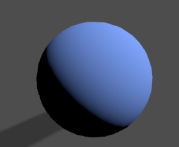
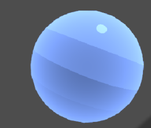

# TheLostVillage_RPG_GAME
#### A group project of COMP30019 of The University of Melbourne ####
 

  

## Table of contents
* [Team Members and Contributions](#team-members-and-contributions)
* [Explanation of the Game](#explanation-of-the-game)
* [Technologies](#technologies)
* [Shader](#shader)
* [Objects and Entities Modelling ](#objects-and-entities-modelling)
* [Evaluation Set up](#evaluation-set-up)
* [Questionnaire Protocol ](#questionnaire-protocol)
* [Evaluation Feedback and Changes](#evaluation-feedback-and-changes)
* [Code Resources](#code-resources)

 

## Team Members and Contributions

| Name | ID |
| :---         |    :---:      |
| Yizhao Huang  | ******* |
| Chenghao Li    | ******* |
| Aonan Zhang    | ******* |
| Yutong Wu    | ******* |

 

## Explanation of the Game

**Introduction**

 
This is an Action Adventure game developed by a 4-people team, named The Lost Village. In this game we built a small world called White Orchard, where the story takes place and the player explores within. The player would play as an amnesiac samurai who woke up in an unfamiliar village, who needs to fight monsters in order to save the village and get himself out of there. During his exploration in White Orchard, he would discover places with different features and complete a series of quests to learn the secret of this village.

 
**How to Play**
 

The game is easy to play and the control should fits most people’s habits. 

 

\-     *F1* to toggle the guide page which contains basic control of the game

 

\-     *WASD* to move, *Space* to jump, *Shift* to sprint.

 

\-     Swap weapons using 1 and 2, interact with the world using *F*.

 

\-     Player has four abilities that share the cooldown, which is displayed down the bottom, Cast them by *QERT* respectively.

 

\-     Use health potion by *G*, the amount of potion player has is displayed at the top-right corner.

 

\-     The amount of gold is also displayed at the top-right corner, the player can buy upgrades with the trader using golds at the Castle left chamber room.

 

\-     The top-left corner shows player’s current stats which are health and attack, they both can be upgraded in trader’s shop.

 

\-     *Tab* will toggle quest window, which displays the current quest player is doing. Receive and complete quest with Erika at Castle right chamber room.

 

\-     *M* will toggle mini-map window, which shows the information of the whole area, includes quest location, treasure location etc. There is an icon HUD along with the map.

 

\-     *ESC* will open the pause menu, which pauses the game and shows four buttons *Resume*, *Menu*, *Save* and *Quit*. 

Press *Resume* close the pause menu, Menu back to main menu, *Save* will save your current progress and Quit for quitting the game.

When you press *Save*, the game would create a save file in your local drive. So when you at the main menu, you can go *Play* – *Continue* to load your save. Although you can only have one save at the time. 

 

\-     At the main menu which the game launches with, the player can choose to go *Play*, *Setting* and *Exit*.

In *Play*, Continue will load your previous save and New Game will start the game from beginning.

In *Setting*, it looks like a lot of options, but we only implemented the *full screen*, *shadow quality* and *texture quality* in Video, as we run out of time for others.

 For *Exit*, it works if you build and run the game, but not in the editor.

 

\-     When talking to an NPC, use *C* to forward the dialogue.

 

## Technologies
Project is created with:
* Unity 2019.4.x

 

## Shader

**Water Shader (Yizhao Huang)**

  

  *The water shown in this gif may look different from the water in game since they have different property values and attributes*

We are using the water shader in project 1 but with some updating. Instead of using the plane mesh as our water mesh. We write a script which can generate mesh with custom vertexes at runtime. The increasing amount of vertex help the Gerstner wave become obvious and realistic.

For rough seas, we need to form sharper peaks and broader troughs. We choose the Gerstner waves for our wave simulation. The Gerstner wave function was originally developed long before computer graphics to model ocean water on a physical basis. As such, Gerstner waves contribute some subtleties of surface motion that are quite convincing without being overt. We choose Gerstner waves here because they have an often-overlooked property: they form sharper crests by moving vertices toward each crest. Because the wave crests are the sharpest (that is, the highest-frequency) features on our surface, that is exactly where we would like our vertices to be concentrated. The Gerstner wave has the following attributes which are amplitude, direction in x & z axis, speed, wavelength and a steepness parameter. In order to make the wave sharper, we sum up four gerstner waves together to control its steepness. The formulas of Gerstner wave are from the book GPU Gems.

The color of the water consists of several parts which include the mainTex, the refraction color by using GrabPass, the reflection color based on the skybox, the ambient lighting color and diffuse water color. For the diffuse water color, we calculate the linear eye depth and apply a color mask based on the depth. The Fresnel effect is used for reflection. We also use the Blinn-Phong lighting model to create a specular effect. In project 2, we also add a noise texture to make the water surface more dynamic. 

**Toon Shader (Chenghao Li)**

Toon Shader is one of the artistic effects that converts the realistic world to photo like world.

Firstly,
Use normal procedure to create a standard shader, (Receive World Directional Light, Add normal, Dot Product to Calculate light strength and convert it to screen space.)

  

Then,
var lightStrength
As Cartoon-like world may not have progressively changed light, change it to dark / light only or have four degree of brightness with ambient light added in while we use “light = lightStrengh * _LightColor0” to calculate world light.

  

Thirdly, Blinn-Phong Reflection
To create a Specular Effect, Pass TextureCoordinate and calculate the vertex’s position to camera’s position.
Blinn-Phong Reflection essentially needs the effective light direction, a project to the vector of the camera’s view. So, Calculate Var HalfVector as an effective light directly to the camera view. 

var HalfVector: the direction of the reflection as it is the combination of view angle and light source direction.
The final value is a float calculated through the dot product between HalfVector and Normal and isLit, which suggests the final amount of light and using “isLit” to calculate if it is light up right now. The ‘Glossiness’ is the power/ The strength of the reflection.
Finally, use smoothstep() function to make the reflection changes suddenly between pixels to make the artistic effects.

  

RimEffect:

To make the object pop out, I wanna add light to the edge of the object, how to do that?
Simply Added more light to the pixels that face away from the view direction.
Calculate var rimLight = 1 - dot(viewDir, normal).
Simply add rimLight to the final Coordinate, get following effect:

  

Alternative:
Also if  rimLight = dot(viewDir, normal), the light is actually reduced at the edge of the object since the dot product ranged between (-1,1), can be negative:

  

Rim Shine only on bright side:

Use var rimIntensity as the intensity of rim effect, we use smoothstep() again to make the effects that the pixels are jumped suddenly (sudden bright or dark).
Use rimLight * pow(BlinnStrength, _RimThreshold);  Set up the threshold and Reflection amount by quadratic.

  

Shadows:

Casting Shadows are Enabled by adding: 
UsePass "Legacy Shaders/VertexLit/SHADOWCASTER"
This line uses another shader’s pass from unity’s vertexLit Shader Library.

Use Unity’s standard Library and built in Variable
var SHADOW_ATTENUATION(i).
This returns 0 - 1 depending on whether the object is shadowed.
Not only multiply this with light factor to create shadows, 
Also multiply this factor with reflection light so it doesn’t generate reflection under Shadows.

  

  

  

 

## Objects and Entities Modelling

**Camera Motion (Aonan Zhang)**

* [MainCamera](#main-camera)  
The camera is Third-Person Perspective kind. Cinemachine is used to monitate the camera. Mouse movement controls the viewing angle, which is x-axis and y-axis. The camera is hanged behind and above the player, and follows and looks at the player with world up. A collider is set to detect if "througing model" issue occurs. With this mechanism, when the camera collides the model with layer is "Ground", the camera will be moved forward to the player to avoid this case.

* [FPSCamera](#fps-camera)    
The fps camera is built to detect the objects' tag that the player is facing. We put this camera into the player's waist, middle of the body, and looks at where the player is facing---that's why it is called fps camera. The mechanism is basically shoots a sphere from the fps camera. The sphere collides many objects, but it only recognizes enemies, npc and some items that waiting for collected for their layer mask is masked according to the setting. It's UI's part after recognizing successfully.

**MainCharacterModelling (Aonan Zhang)**

* [Model(Resources)](#model)	
Simply pulled from website, and animation as well.

* [BasicMovementLogic](#BasicMovementLogic)	
Same as camera motion logic, mouse movement input controls x and y axis so no conflicts will occur. In order not to let player jump without limits, we set an object which is used to judge if player is on the ground, so that player cannot jump in the sky like ninja. the velocity on y axis, which is gravity, will be applied when playe is in the jumping state. When 1 or more inputs from "WASD" occur, the moving direction will be calculated and the moving distance, dependent on direction calculated, time and speed, as well. Pressing "LeftShift" will shift the speed of player, into "running" state if has "WASD" input.

* [Animation](#animation)	
Animator controller is used to manage main character's all animations. Including "walk", "run", "jump", "drink", "collect", "death", countless "attack" and so on. Dealing with transition from one animation state to another smoothly is kinda hard to complete by hand. Adjustments are made to let animation match the speed, so no "space walk" occurs, and sound effect and so on perfectly. No "hurt" animation is applied to because we think it will affects attacking-fluency.

* [PowerfulSkills](#PowerfulSkills)	
The main character has a bunch of powerful skills, and three forms that can shift to. In the "fist form" and "sword form", player can press mouse button 1 or 2 to do normal attack, and "qert" to release powerful skills with beautiful powerful effects. The main character is binded with a sphere to detect if his fist or sword has attacked/collided the objects with "enemy" layer. If the player gains the "moon blade", he can also buy the information where the moon blade hides with a great cost, he can shift to "Ludwig's form"---the main character can't do normal attack but instead, he gains four powerful destroyable skills. All these four skills can be used only once. The "moon blade" is a long range weapon, so the UI will reminds player is the "moon blade" has locked on the target. "Moon blade" is designed to be a weapon for boss battle, and an exploration target during the game.

**NPCModelling (Yizhao Huang)**

Our non-player characters are free resources on internet. We set up the animator for each characters and create scripts to control their behaviors. 

* [HumanNPC](#HumanNPC)  
For human NPC, we have Erika who is in charge of mission published, the player can interact with her and push the story line forward. When player talking to Erika, she will stand up and face toward the player while talking. Next is Abe who is the owner of shop, the player can interact with him to purchase items and upgrade ability. We also have a ninja who is patrolling around the castle and two guards standing outside the castle.

* [Non-HumanNPC](#Non-HumanNPC)  
For non-human NPC (monsters), we use nav mesh in Unity for their navigation. These NPC have various states, for instance, Idle; Wander; Chase; Attack; Dead. When the certain condition is satisfied, they will switch their states. 

**Terrain Modelling (Chenghao Li)**

What I actually started with is "Nature Starter Pack" in Asset Store. The Plants and Various Terrain gave me some ideas about how our game's environment will look like.
The Terrain Tool was downloaded from Asset Store to create various shaped mountains. The Map was initially 500X500, but later we found that it may be too small for a ARPG game.
Therefore, I started make it larger from 750X750 to 1000X1000 Right now. The terrain was initially set up with a huge mountain in the middle while river flows besides it. It turns out that the mountain is taking up too much space and I decided to just replace it by a platform for the Castle, the main place for our game starters.

The Dark Forest idea comes in when considering where to fight the final boss. However, due to the space limitation, we started thinking about making a new scene for the boss. 
To reduce the complexity of loading and switching between scenes. I suggested an easy way to do this, make the boss fight another seperate terrain that appears in the same scene so we just need to teleport the player. To optimize game performance, the seperated terrain was disabled at first, Big Brain :).

The Buildins were downloaded from the asset store within different packages mainly focuing on "not modern", "medieval focused?" The big Castle becomes a center focus of mine. I set it up high on the mountain and in the middle of the map and making those mission locations at each corner of the map so the player can explore different locations with same amount of ETAs.

The Burning house at the right bottom of the map is used with fire particle system and player can slay rhinos, exploring treasures there.
The river-side village is set up with tons of rhinos and also tons of gold coins in the house for player to pick up.
The Dark Forest is camped with dark evil enemies, player slays them and go challenge the godWeapon at the peak of the dark mountain inside the dark forest.
The GreenLand, covered with tons of valuable mines, player can collect it for mission purpose and gain gold.
The river passing through the whole map is the division of the dark forest and main map. It is suggested that the river protects the castle in some way.

To make our terrain looks great with depth, multiple terrains are used for displaying a further mountain illusions for gamer. The Textures differed and uses Toon Shader that I have written alone.

 

## Evaluation Set Up

**Observational Methods**: Think Aloud, Cooperative evaluation

**Query Technology**: Questionnaire

**Participants**:
| Name | gender | age | identity |
| :---         |    :---:      |     :---:      |          ---: |
| Yusong Wen  | Male | 15-20  |  Uni Student |
| Yuxiang Xie    | Male | 20-25    |  Uni Student |
| Jeff Yang | Male | 20-25      | Uni Student |
| Xiaojun Tong | Male | 20-25     |Uni Student |
| Jiachen Zhang    | Male | 20-25     | Uni Student |

 

## Questionnarie Protocol

**Consent**

I agree to participate in the game test conducted by the group 38.
I understand that participation in this usability study is voluntary and I agree to immediately raise any concerns or areas of discomfort during the session with the study administrator.
Please sign below to indicate that you have read and you understand the information on this form and that any questions you might have about the session have been answered. 

Date: _________

Please print your name: ____________________________________________________   

Please sign your name: ____________________________________________________   

Thank you!

We appreciate your participation.

**Pre-test Questionnaire**

1. 	On average, how often do you play video games?

*  Daily

*  Weekly

*  Monthly

*  Rarely
 
2. 	What is the platform you commonly play on for video games?

*  PC

*  Mac

*  Mobile

*  Console

*  Mixed

3. 	Have you paid for video games or in-game purchases?( If NO, skip question 4 )

*  Yes

*  No

4. 	How often?

*  Daily

*  Weekly

*  Monthly

*  Rarely

5.	To what extent do you accept the violence in video games?

* Strongly unacceptable

* Unacceptable

* Don’t mind

* Acceptable

* Strongly acceptable

6. 	 What is your favourite video game type? 

7. 	What is your favourite video game?

**Cognitive Walkthrough**

| **Task1**    |  |
|  :---         | :---:  |
| **Description:**      | -----  Accept the request from Erika and find the mission location  ---- |
| **Frequency:**      | High |
| **Significance:**      | Critical |
| **Issues:**      |  |
| **User Actions**      | **Interface Feedback** |
|Step1:         |       |
|Step2:         |       |
|Step3:         |       |
|Step4:         |       |

| **Task2**    |  |
|  :---         | :---:   |
| **Description:**      | Use the HPbottle and pick up the dropping coins from dead monster |
| **Frequency:**      | Medium |
| **Significance:**      | Critical |
| **Issues:**      |  |
| **User Actions**      | **Interface Feedback** |
|Step1:         |       |
|Step2:         |       |
|Step3:         |       |
|Step4:         |       |

| **Task3**    |  |
|  :---         | :---:   |
| **Description:**      | -------  Complete the first mission in game and report to Erika --------|
| **Frequency:**      | Medium |
| **Significance:**      | Representative |
| **Issues:**      |  |
| **User Actions**      | **Interface Feedback** |
|Step1:         |       |
|Step2:         |       |
|Step3:         |       |
|Step4:         |       |

| **Task4**    |  |
|  :---         | :---:   |
| **Description:**      | ------------ Find the shop and upgrade your attack ability -------------|
| **Frequency:**      | High |
| **Significance:**      | Critical |
| **Issues:**      |  |
| **User Actions**      | **Interface Feedback** |
|Step1:         |       |
|Step2:         |       |
|Step3:         |       |
|Step4:         |       |

| **Task5**    |  |
|  :---         | :---:   |
| **Description:**      | --- Find the moon blade and change your weapon to moon blade ---|
| **Frequency:**      | Low |
| **Significance:**      | Representative |
| **Issues:**      |  |
| **User Actions**      | **Interface Feedback** |
|Step1:         |       |
|Step2:         |       |
|Step3:         |       |
|Step4:         |       |

**Post-test Questionnaire**

1. Please rate the game on the following scales:

|  | Strongly disagree | Somewhat disagree | Neither agree nor disagree | Somewhat agree | Strongly agree |
| :---         |    :---:      |     :---:      |    :---:   |    :---:   |    :---:   |
| "I found the game objectives clear and easy to follow."  |  |  |  |  |  |
| "I found the game control intuitive and straight-forward."     |  |  |  |  |  |
| "I thought the battle system was challenging." |  |  |  |  |  |
| "I thought that I would need the support of an expertised person to be able to play this game."  |  |  |  |  |  |
| "I felt my device could run this game at a comfortable frame rate."   |  |  |  |  |  |
| "I thought the quality of the graphics in this game is good."    |  |  |  |  |  |
| "I would imagine that most people would learn to play the game very quickly."   |  |  |  |  |  |
| "I found the quest content and NPC dialogue interesting."   |  |  |  |  |  |
| "I found items in the shop are abundant."   |  |  |  |  |  |
| "I thought the sound effects and bgm are engaging."   |  |  |  |  |  |

2. Any other comments?

______________________________________________________________________________________________________________________________________

 

## Evaluation Feedback and Changes

  

 

## Code Resources
Toon Shader Tutorial:

* https://roystan.net/articles/toon-shader.html
 
Shield Shader Code Reference:

* https://github.com/vux427/ForceFieldFX
 
Water Shader Resources:

* GPU Gems, Chapter 1. Effective Water Simulation from Physical Models 

*	SIGGRAPH 2001, Tessendorf J. Simulating ocean water[J]. Simulating nature: realistic and interactive techniques.

*	The book: https://github.com/candycat1992/Unity_Shaders_Book
